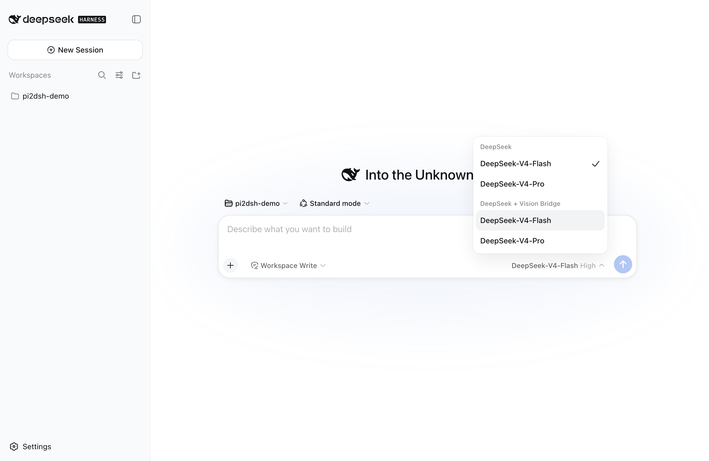
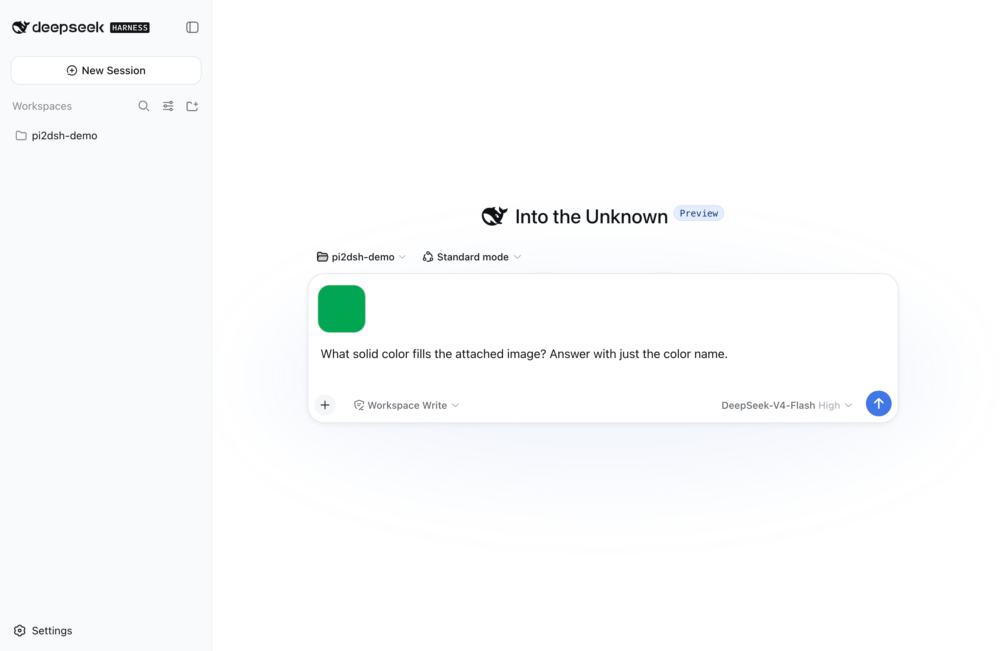
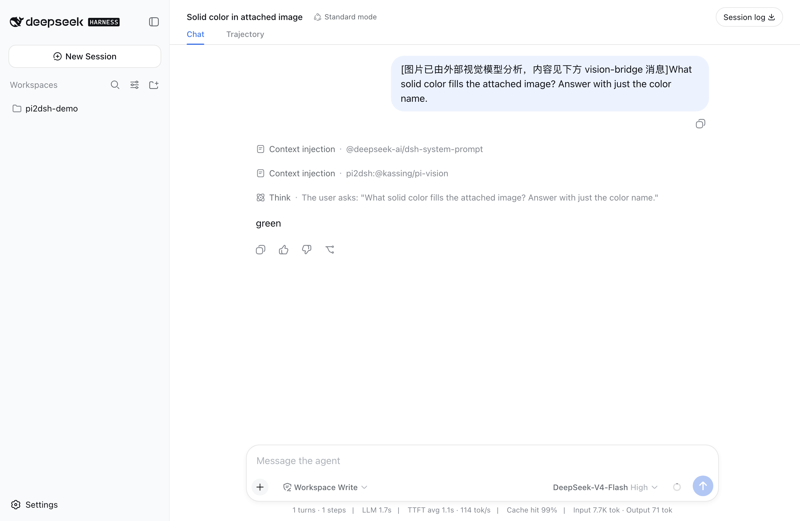

# Main post — DSH community (Show and tell)

**Title**: Run Pi ecosystem plugins on DSH, unmodified — `dsh plugin add pi2dsh`, then add any Pi package

**Attach**: `assets/01-vision-companion-model-picker.png`, `assets/02-image-accepted-by-text-only-model.png`, `assets/03-vision-bridge-answer.png`
(optional second set, for the side-conversation section: `assets/01-side-conversation-main-thread-clean.png`, `assets/02-side-conversation-panel.png`, `assets/03-side-conversation-host-catalog.png`, `assets/05-side-conversation-child-view.png`)

---

Sharing [pi2dsh](https://github.com/weijiafu14/pi2dsh) (npm: `pi2dsh`) — a compatibility engine that lets Pi ecosystem plugins run on DeepSeek Harness as published, with no conversion step and no fork.

## Two commands

```sh
dsh plugin --profile web add pi2dsh          # the engine, once
dsh plugin --profile web add @kassing/pi-vision   # any Pi package, as published
```

Restart dsh. That's the whole install. The engine discovers the Pi packages in your profile's dependencies and mounts them — add one and it's there, remove it and it's gone. Upgrades stay independent: `add pi2dsh@latest` doesn't touch your plugins, `add <pkg>@latest` doesn't touch the engine.

## What it actually does

pi2dsh implements Pi's public extension surface **once**, as a general host ABI, on top of DSH's native services. A Pi package that sticks to Pi's public API sees Pi; DSH sees an ordinary plugin. Nothing in the core special-cases a package name.

The design rule is: **if DSH already has the capability, translate configuration and use DSH's implementation** — never build a parallel runtime. Model calls go through the DSH `llm` directory, MCP through the official MCP client, credentials through DSH credentials, compaction through DSH's compaction service, sessions through `ctx.sessions`. Plugin code never gets a direct transport.

## Example: give a text-only model eyes

DSH's web app only accepts image attachments when the selected model declares image input. With the engine installed, every text-only route in your model directory automatically gets a `<route>-vision` companion — no configuration:



Select it, paste an image, ask:



The attachment is accepted, the Pi plugin ([@kassing/pi-vision](https://www.npmjs.com/package/@kassing/pi-vision)) analyzes it with a vision endpoint you configure, the image block becomes guide text, the analysis arrives as a context-injection row, and your text-only model answers correctly — pixels never reach the text-only wire:



Same thing in the CLI:

```console
$ dsh --profile demo "What solid color fills the image at ./solid-green.png ? Answer with just the color name."
[pi2dsh engine] mounting 1 Pi package(s): @kassing/pi-vision
[pi2dsh] image-admission companion route "deepseek-official-vision" registered for "deepseek-official"
[pi2dsh] loaded @kassing/pi-vision: 0 tools, 2 commands, 0 skill roots
green
```

Full runnable example, including the probe images: [`examples/vision-bridge`](https://github.com/weijiafu14/pi2dsh/tree/main/examples/vision-bridge).

## Example: a side question that doesn't derail the thread

Pi has a family of plugins for asking something off-topic mid-session
(`pi-btw`). On DSH that side thread becomes a **real child session**: it shows
up in DSH's own subagent dropdown, opens in its own view with its own
composer, and stays continuable.

```text
Name three classic sorting algorithms, one line each.
→ (answers)

/btw who wrote the novel Dune? name only
→ btw · Completed          ← the only thing added to the main conversation
```

The answer (`Frank Herbert.`) lives in the side thread. Merging it back is
your explicit action — `/btw-inject` — and only then does it enter the main
conversation. The child records DSH's own identity event
(`subagent/descriptor`), so the host's native subagent UI lists, names, opens
and continues it without anything of ours drawing that part.

The web app also shows the exchange **where you asked it**, in a floating panel
over the conversation. That half is ours, and it is worth saying how, because
it is the part of DSH we had not used before: DSH's browser shell is a plugin
surface of its own — a package declares `dsh.client`, exports a `./client`
bundle, and takes a slot. `shell.overlay` is the host's documented seat for "a
frame-wide surface of your own", so pi2dsh ships a browser half that renders
the side thread there, fed by this package's own route. The Pi plugin is
unmodified and knows nothing about any of it.

Two host details cost us an afternoon and are easy to miss: the package must
also export `./package.json` (the host resolves a client bundle's manifest by
subpath, and the failure is swallowed into "this package has no browser half"),
and the `./client` artifact is a closure-factory bundle, not plain ESM.

Two general ABI gaps closed to make this work, neither package-specific: Pi's
public, settable `AgentState.messages`, and an input descriptor on every
bridged command (without it the web app parses `/btw <question>` as chat
rather than a command — worth knowing for anyone bridging commands with
arguments).

Full runnable example: [`examples/side-conversation`](https://github.com/weijiafu14/pi2dsh/tree/main/examples/side-conversation).

## Where things stand

- The top-50 Pi catalog by downloads passes static screening with **zero blocked** packages, and 47 of 50 answer a black-box probe after mounting. That means the bridge covers the surfaces those packages touch — it does *not* mean each plugin's own feature is known-good end to end, which is a separate, slower list (the plugins named in the next bullet). Worth being precise about: `pi-btw` graded "probe-working" while `/btw <question>` actually failed on a real session, until two general ABI gaps were closed in 0.11.0.
- End-to-end verified on a real DSH loop, CLI **and** web: tools, slash commands (including commands with arguments), prompt commands, skills, lifecycle events, `before_agent_start` input bridging, context transforms, interactive OAuth `/login`, subagents through `ctx.agents`, side conversations as real child sessions, and the vision path above.
- 95 public-API contract tests; `pnpm verify` (typecheck + tests + packaging) is the gate for every release.

## Honest boundaries

Capabilities with no DSH mapping don't pretend. Each one is graded:

- **Real, on DSH's own surfaces**: session control (`newSession` / `fork` / `navigateTree` / `switchSession`) runs on `ctx.sessions.create` / `ctx.sessions.fork`, so the sessions genuinely exist with fork lineage; `ctx.compact()` triggers DSH's official manual compaction; `reload()` really remounts plugin entries.
- **Host-defined**: `shutdown()` is absorbed — Pi's own docs put shutdown behavior in the host's hands, and on DSH the user owns process exit. The plugin keeps running and you get told once.
- **Deliberately unavailable**: installing packages at runtime (that's `dsh plugin add` behind pnpm's build-script approval) and composing a standalone model stack (the model directory is host configuration). These throw a structured, catchable error; importing them is flagged at startup, and if a plugin needs one during startup it's reported unusable with a removal hint instead of failing mysteriously later.
- **Registered but never fires**, matching Pi's own non-TUI modes: footer/statusline/shortcut decoration, raw terminal input, and provider request/response hooks (those belong in a DSH llm adapter).

Every gap is reported to the user **once per plugin**, naming what stopped working, that the rest still works, and how to remove the plugin if that capability was the point.

## Two things DSH might want to know

1. **No registration surface for third-party session events.** `Session.append()` can't mark an envelope `ignorable: true`, and the known-event-type list is generated in-repo, so out-of-repo plugins can't safely add custom entries — we persist Pi custom entries in a sidecar next to the session instead. The session README defers this "until such a consumer exists"; pi2dsh is that consumer.
2. **A fresh profile created by `dsh plugin add` boots without a driver.** The generated profile lists only the base bundle, so a first prompt hangs with no diagnostic until you add a surface bundle (`dsh-headless` / `dsh-web-app`). A warning at boot would save newcomers the confusion.

(Also happy to file: the web app silently drops a send failure when the RPC returns 200 with an error body.)

Feedback and gap reports welcome — a missing capability that's really DSH-mappable is a bug on our side, and fixing one usually unlocks every plugin that hits it.
